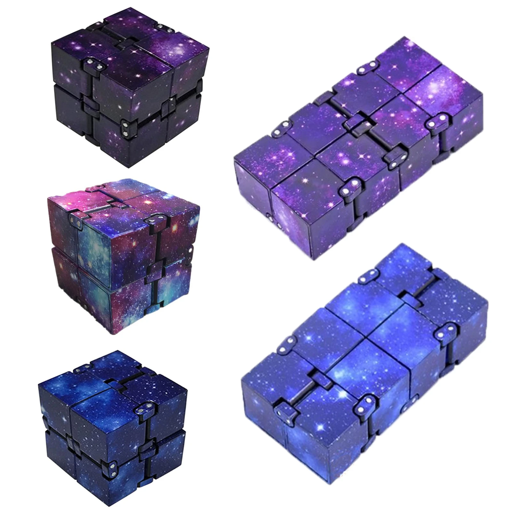
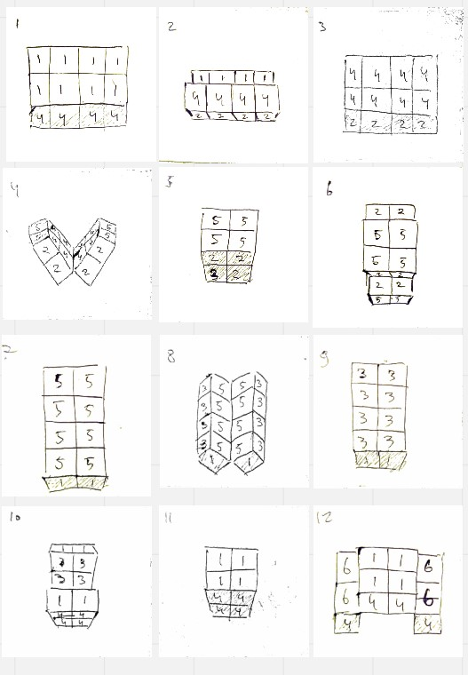
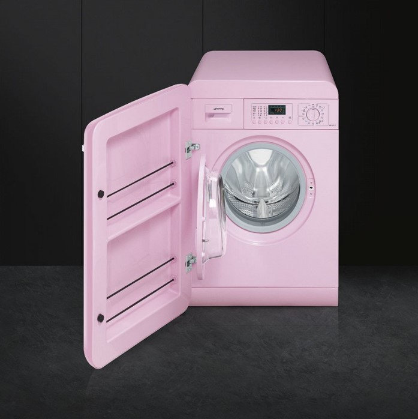
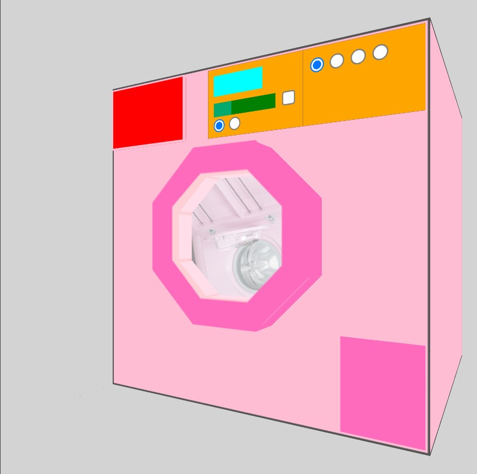
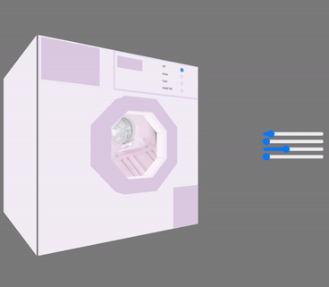

# 🔥 CSS-to-the-rescue-22-23 🔥

This repository is all about the course CSS To The Rescue of the minor Web Design & Development at the CMD Amsterdam. 

 

 

## 🗒️ Debrief 🗒️

The goal of this course is to experiment with CSS to create something unique and interesting. I'll look into the possibilities of CSS and new experimental features. In the end I'll not only turn in something visually pleasing, but also show of my experiments and the process of creating it.

 

There are four themes to choose from for this assignment;

- A modular control panel
- An interactive fireworks show
- A 3d Rubik's cube
- Converting a Tailwind project to modern CSS.

I decided to go with a mix of the modular control panel and the rubiks cube.

 

 

## ✔️ Personal goals ✔️

There are a few things I want to learn and/or get better at during this course.

- Learn more about new CSS features like `:has()` , `:is()` and `:where()` 
- Develop my skills when it comes to 3d CSS and animations
- Work on a smaller project to be able to go more into detail and experiment more
- Have some fun :)

 

 

## 🤔 Prolouge 🤔

In the week before the course started I started to think about what I wanted to make. I liked the challenge of the Rubik's cube, but wanted something slightly different. On my desk I always have a fidget toy that's called an Infinity Cube. This cube is made up of 8 smaller cubes that can be moved around to create different shapes. I thought it would be fun to make a digital version of this cube.

 

I started planning out the steps on animation and numbered the different sides of the cube.

 

I set up the base html structure and created all the seperate cubes and buttons to trigger the animations.
Eventually I came across an issue where overlapping transform origins caused the cubes to rotate in the wrong direction. This proved to be quite difficult to fix and brought my project to a standstill.

Eventually I decided to start over and make a modular control panel instead. I found this to be more interesting and, since I want to be able to finish this project, a bit easier to make. 

 

I still wish to continue making the Infinity Cube some day, but I'll have to do some more research on how to fix the issue I ran into. Sanne(teacher) already adviced me to use CSS variables which may prove to be useful.

 

 

## 👚 Chosen theme 👚

I decided to go with a modular control panel. I wanted to make something that was a bit more complex than the examples given in the course but still give myself the opportunity to experiment with new CSS features.  

The control panel I've chosen is of a washing machine. I was thinking about all kinds of interesting control panels and somehow managed to end up with a washing machine. The control panel itself is quite simple, but I wanted to create the entire machine in 3d which could offer me some interesting challenges.

Below is the machine I decided to use as reference. I may change some things in the design but this gets the general idea.

 

 

## Guest talk Kilian Valkhof

On thursday 16-02-2022 we had a guest talk by Kilian Valkhof. He talked about his work as a developer at Electron Governance Team and his work on Polyplane. During this talk he mostly showed us HTML/CSS solutions for common Javascript practices.

There were several new technologies and techniques that I found interesting. I'll try to list them below.

- Using `outline: transparent` instead of `outline: none` to remove outlines but still have them be visible for high contrast users
- Using `datalist` instead of `select` for dropdowns to be able to search through the options and to be able to add custom options that aren't in the list.
- For `<form>` elements you can use `color-scheme: dark light` to make the form elements adapt to the dark/light mode of the browser without having to set up custom css variables.
- In most cases, using `loading="lazy"` on images is a good idea to improve performance though it's preferred to not use it for images that are in the viewport on load.
- You can also use `loading="lazy"` on iframes to improve performance.
- For improved accessibility you can add `cursor: pointer` to a `
` on hover to make it more clear that it's clickable.
- You can now create modals using very little Javascript which improves performance and accessibility. You can use `dialog` to create a modal. You can also use `dialog::backdrop` to create a dark background that fades in when the modal opens.

There are also a few features that will become available in the future that I found interesting.

- `Masonry` layouts for grid items. This will allow you to create a grid layout where the items can have different sizes and will automatically be placed in the correct position.
- `Selectmenu`'s enable better styling for dropdowns and select elements.
- `Scroll linked animations` will allow you to create animations that are triggered when an element is scrolled into view (very cool).

Alltogether I learned alot from this talk and I'm excited to see what the future of CSS will bring.

 

 

## 📚 Version 1 📚

The first version of the washing machine was less about the design and more about the functionality. I wanted to make sure I could create the entire machine in 3d and that I could make the buttons work. I used basic colors to fill in the shapes and dove deep into new technologies like the use of `:has()` to create conditional actions( for example when the door is open the laundry should stop rotating) and used container query sizing to get the machine to relatively scale to its parent. this way it would be responsive right off the bat.

 

 

## 📚 Version 2 📚

The second version goes even deeper into the functionality of the machine. For development purposes I added sliders that turned the machine around in several directions so I could better see what was going on. I also added a few more buttons to make the machine more interactive. I also added a few more animations and edited colors to make the machine more realistic.

 

At this point I started to struggle a bit with the complexity of the CSS and the amount of selectors I was using. I decided to split my main CSS file into several component files to make it easier to work with. I also started to use more CSS variables to make it easier to change colors and values in the future.

 

 

## 📚 Final version 📚

For the final version of the machine I changed the original pink colors to be more white and realistic. I added metallic colors to the buttons and the machine itself. I added several new interactions and worked with CSS features I had previously not worked with before. These include using filters with hue-rotate to create a color rainbow effect and used more complex gradients to create checkers patterns for the floor.